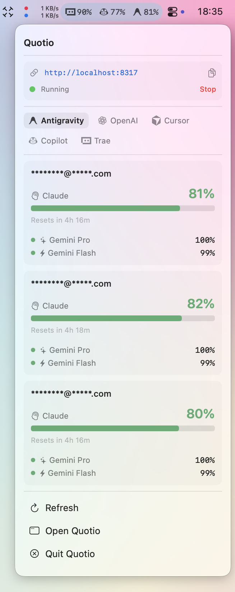
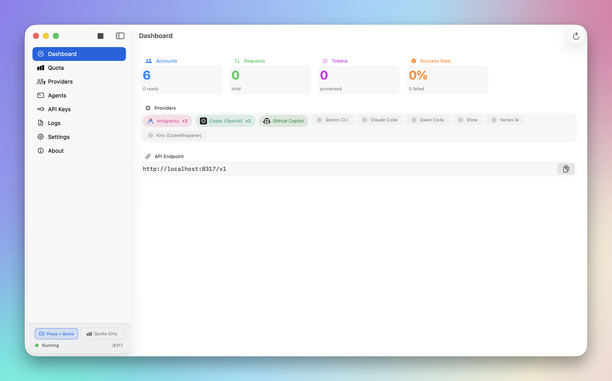
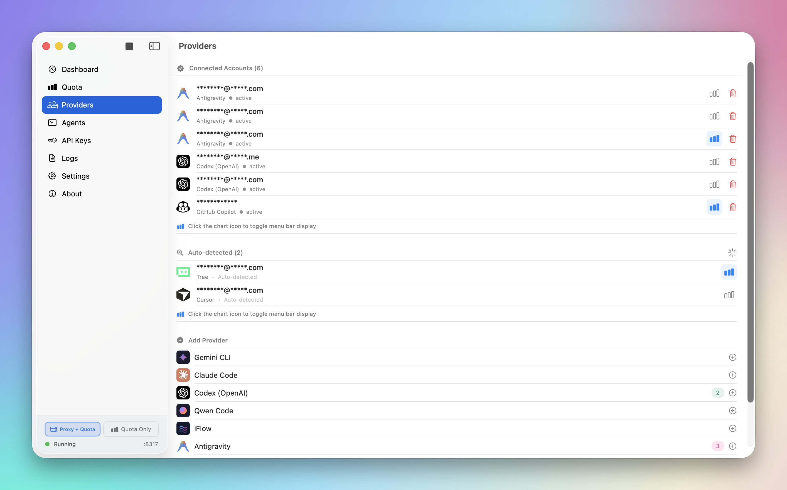
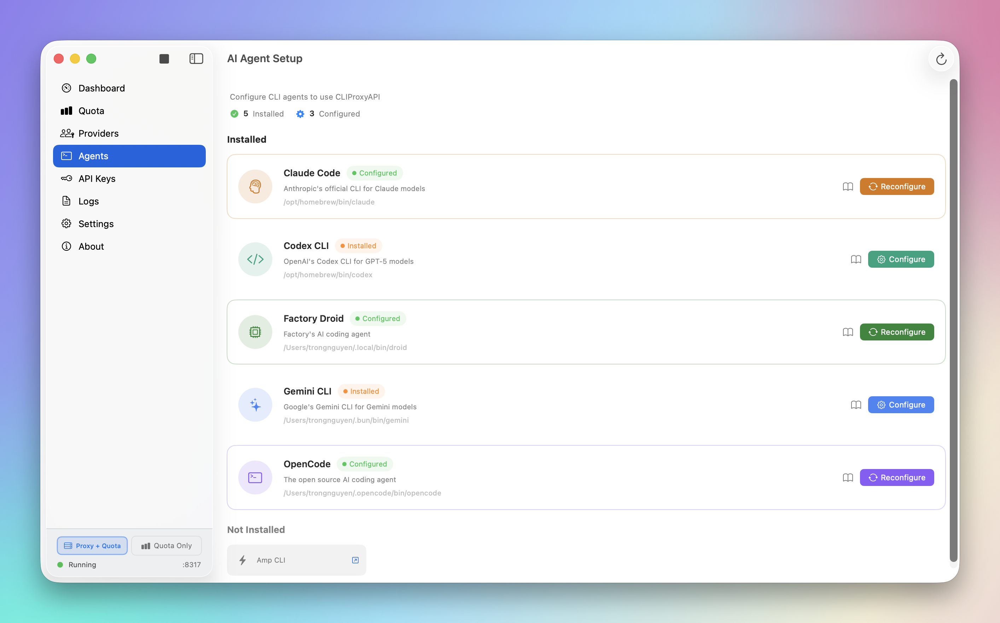
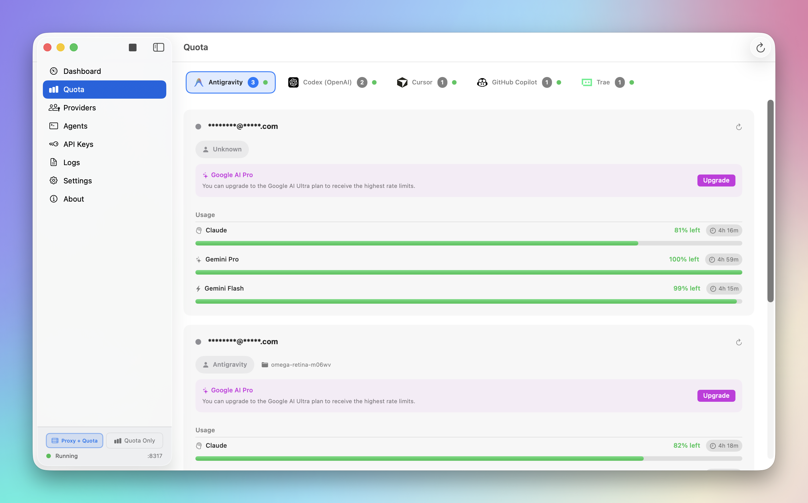
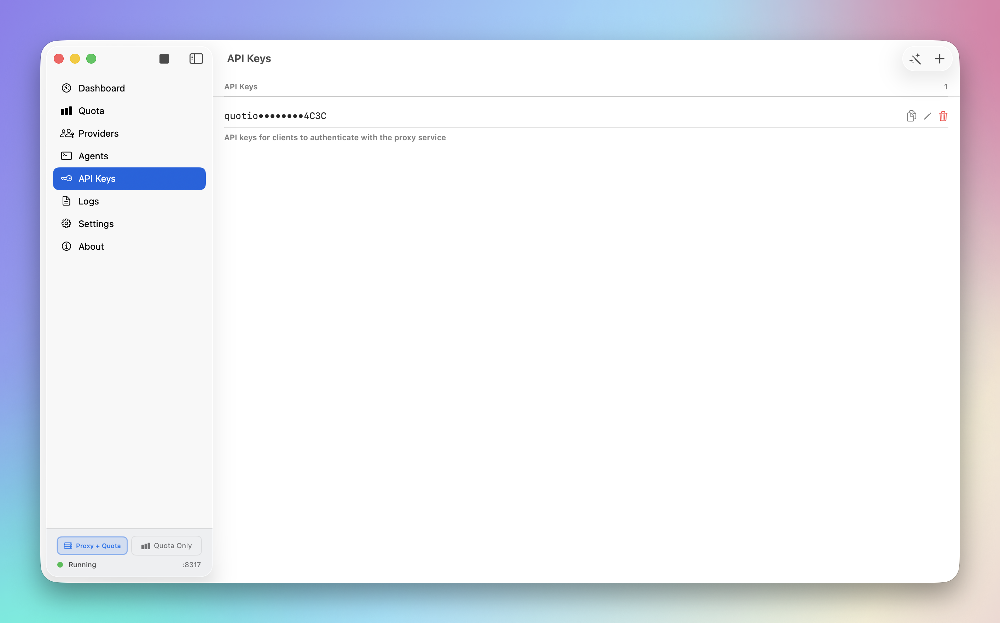
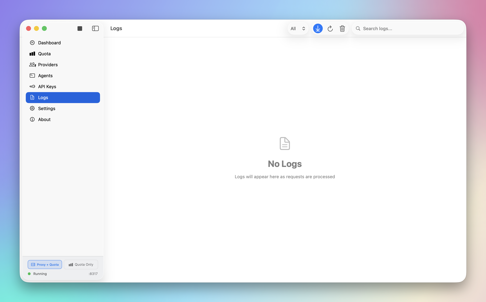
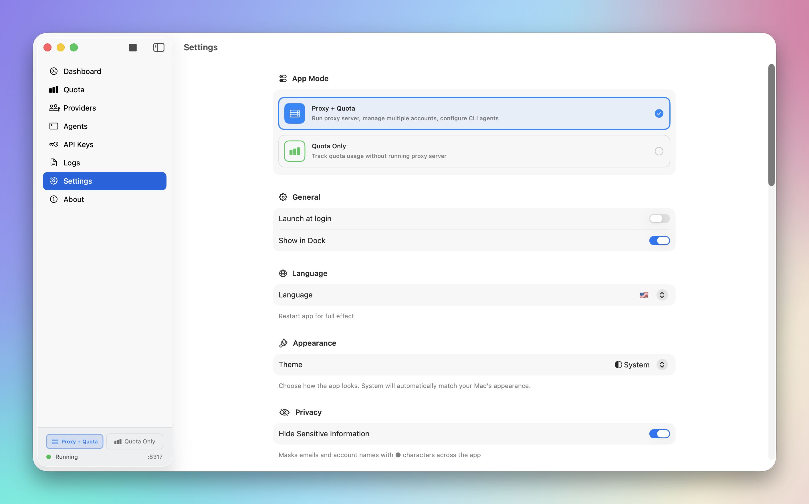

# Quotio

<p align="center">
  <picture>
    <source media="(prefers-color-scheme: dark)" srcset="screenshots/menu_bar_dark.png" />
    <source media="(prefers-color-scheme: light)" srcset="screenshots/menu_bar.png" />
    
  </picture>
</p>

<p align="center">
  
  
  
  <a href="https://discord.gg/dFzeZ7qS"></a>
  <a href="README.md"></a>
  <a href="README.vi.md"></a>
  <a href="README.fr.md"></a>
</p>

<p align="center">
  <strong>macOS 上 AI 编程助手的终极控制中心。</strong>
</p>

Quotio 是一款原生 macOS 应用，用于管理 **CLIProxyAPI** ——为你的 AI 编程代理提供动力的本地代理服务器。它帮助你在一个地方管理多个 AI 账号、跟踪配额并配置 CLI 工具。

## ✨ 功能特性

- **🔌 多提供商支持**：通过 OAuth 或 API Key 连接 Gemini、Claude、OpenAI Codex、Qwen、Vertex AI、iFlow、Antigravity、Kiro、Trae 和 GitHub Copilot 账号。
- **📊 独立配额模式**：无需运行代理服务器即可查看配额和账号，适合快速检查。
- **🚀 一键 Agent 配置**：自动检测并配置 Claude Code、OpenCode、Gemini CLI 等 AI 编程工具。
- **📈 实时仪表盘**：实时监控请求流量、token 使用量和成功率。
- **📉 智能配额管理**：按账号可视化配额追踪，并支持自动故障转移策略（轮询 / 先满）。
- **🔑 API Key 管理**：为本地代理生成并管理 API Key。
- **🖥️ 菜单栏集成**：在菜单栏快速查看服务器状态、配额概览和自定义提供商图标。
- **🔔 通知提醒**：当配额不足、账号冷却或服务异常时推送提醒。
- **🔄 自动更新**：内置 Sparkle 更新器，平滑升级。
- **🌍 多语言支持**：英文、越南语和简体中文。

## 🤖 支持的生态

### AI 提供商
| 提供商 | 认证方式 |
|----------|-------------|
| Google Gemini | OAuth |
| Anthropic Claude | OAuth |
| OpenAI Codex | OAuth |
| Qwen Code | OAuth |
| Vertex AI | Service Account JSON |
| iFlow | OAuth |
| Antigravity | OAuth |
| Kiro | OAuth |
| GitHub Copilot | OAuth |

### IDE 配额追踪（仅监控）
| IDE | 说明 |
|-----|-------------|
| Cursor | 安装并登录后自动检测 |
| Trae | 安装并登录后自动检测 |

> **注意**：这些 IDE 仅用于配额使用监控，不能作为代理的提供商。

### 兼容的 CLI Agent
Quotio 可以自动配置以下工具使用你的集中式代理：
- Claude Code
- Codex CLI
- Gemini CLI
- Amp CLI
- OpenCode
- Factory Droid

## 🚀 安装

### 系统要求
- macOS 14.0（Sonoma）或更高版本
- OAuth 认证需要互联网连接

### Homebrew（推荐）
```bash
brew tap nguyenphutrong/tap
brew install --cask quotio
```

### 下载
从 [Releases](https://github.com/nguyenphutrong/quotio/releases) 页面下载最新的 `.dmg`。

> ⚠️ **注意**：应用尚未使用 Apple Developer 证书签名。如果 macOS 阻止运行，请执行：
> ```bash
> xattr -cr /Applications/Quotio.app
> ```

### 从源码构建

1. **克隆仓库：**
   ```bash
   git clone https://github.com/nguyenphutrong/quotio.git
   cd Quotio
   ```

2. **在 Xcode 中打开：**
   ```bash
   open Quotio.xcodeproj
   ```

3. **构建并运行：**
   - 选择 “Quotio” scheme
   - 按下 `Cmd + R` 构建并运行

> 应用首次启动时会自动下载 `CLIProxyAPI` 二进制文件。

## 📖 使用方法

### 1. 启动服务器
打开 Quotio，在仪表盘点击 **Start** 初始化本地代理服务器。

### 2. 连接账号
进入 **Providers** 标签页 → 点击一个提供商 → 通过 OAuth 认证或导入凭据。

### 3. 配置 Agent
进入 **Agents** 标签页 → 选择已安装的 Agent → 点击 **Configure** → 选择自动或手动模式。

### 4. 监控使用情况
- **Dashboard**：整体健康状态与流量
- **Quota**：按账号查看使用情况
- **Logs**：用于调试的原始请求/响应日志

## ⚙️ 设置

- **端口**：更改代理监听端口
- **路由策略**：轮询（Round Robin）或先满（Fill First）
- **自动启动**：Quotio 打开时自动启动代理
- **通知**：开关各类提醒

## 📸 截图

### 仪表盘
<picture>
  <source media="(prefers-color-scheme: dark)" srcset="screenshots/dashboard_dark.png" />
  <source media="(prefers-color-scheme: light)" srcset="screenshots/dashboard.png" />
  
</picture>

### 提供商
<picture>
  <source media="(prefers-color-scheme: dark)" srcset="screenshots/provider_dark.png" />
  <source media="(prefers-color-scheme: light)" srcset="screenshots/provider.png" />
  
</picture>

### Agent 配置
<picture>
  <source media="(prefers-color-scheme: dark)" srcset="screenshots/agent_setup_dark.png" />
  <source media="(prefers-color-scheme: light)" srcset="screenshots/agent_setup.png" />
  
</picture>

### 配额监控
<picture>
  <source media="(prefers-color-scheme: dark)" srcset="screenshots/quota_dark.png" />
  <source media="(prefers-color-scheme: light)" srcset="screenshots/quota.png" />
  
</picture>

### 备用配置
<picture>
  <source media="(prefers-color-scheme: dark)" srcset="screenshots/fallback_dark.png" />
  <source media="(prefers-color-scheme: light)" srcset="screenshots/fallback.png" />
  
</picture>

### API 密钥
<picture>
  <source media="(prefers-color-scheme: dark)" srcset="screenshots/api_keys_dark.png" />
  <source media="(prefers-color-scheme: light)" srcset="screenshots/api_keys.png" />
  
</picture>

### 日志
<picture>
  <source media="(prefers-color-scheme: dark)" srcset="screenshots/logs_dark.png" />
  <source media="(prefers-color-scheme: light)" srcset="screenshots/logs.png" />
  
</picture>

### 设置
<picture>
  <source media="(prefers-color-scheme: dark)" srcset="screenshots/settings_dark.png" />
  <source media="(prefers-color-scheme: light)" srcset="screenshots/settings.png" />
  
</picture>

### 菜单栏
<picture>
  <source media="(prefers-color-scheme: dark)" srcset="screenshots/menu_bar_dark.png" />
  <source media="(prefers-color-scheme: light)" srcset="screenshots/menu_bar.png" />
  
</picture>

## 🤝 贡献

1. Fork 本项目
2. 创建功能分支（`git checkout -b feature/amazing-feature`）
3. 提交修改（`git commit -m 'Add amazing feature'`）
4. 推送到分支（`git push origin feature/amazing-feature`）
5. 创建 Pull Request

## 💬 社区

加入我们的 Discord 社区，获取帮助、分享反馈并与其他用户交流：

<a href="https://discord.gg/dFzeZ7qS">
  
</a>

## ⭐ Star 历史

<picture>
  <source
    media="(prefers-color-scheme: dark)"
    srcset="
      https://api.star-history.com/svg?repos=nguyenphutrong/quotio&type=Date&theme=dark
    "
  />
  <source
    media="(prefers-color-scheme: light)"
    srcset="
      https://api.star-history.com/svg?repos=nguyenphutrong/quotio&type=Date
    "
  />
  
</picture>

## 📊 仓库活动


## 💖 贡献者

没有你们，我们无法做到这一切。感谢！🙏

<a href="https://github.com/nguyenphutrong/quotio/graphs/contributors">
  
</a>

## 📄 许可证

MIT License。详见 `LICENSE`。
